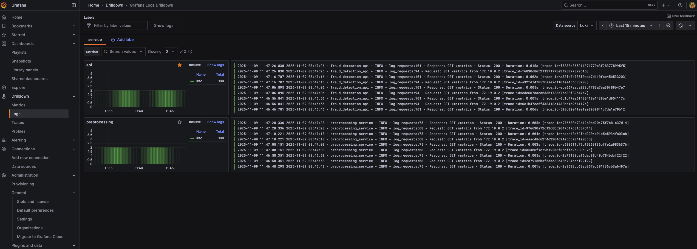

# Logging Documentation

Complete logging setup for the Fraud Detection MLOps pipeline.


## Overview

The system implements structured logging with:
- File-based logging with automatic rotation
- Console logging for real-time monitoring
- Request and response logging via middleware
- Distributed tracing integration with OpenTelemetry
- Trace ID correlation across services
- Configurable log levels via environment variables
- Centralized log storage in ./logs directory
- Grafana visualization via Loki log aggregation

## Log Files

All logs are stored in the `./logs` directory and mounted from Docker containers:

| File | Service | Description |
|------|---------|-------------|
| `api.log` | Fraud Detection API | All API requests, predictions, model loading |
| `preprocessing.log` | Preprocessing Service | Feature engineering operations |
| `api.log.1`, `api.log.2`, etc. | Fraud Detection API | Rotated backup files |
| `preprocessing.log.1`, etc. | Preprocessing Service | Rotated backup files |

## Log Format

### Standard Log Format

```
2025-11-08 10:15:23 - fraud_detection_api - INFO - predict_fraud:325 - Prediction completed in 0.123s - Fraud: True, Probability: 100.00%
│                      │                     │      │                │
│                      │                     │      │                └─ Log message
│                      │                     │      └─ Function name and line number
│                      │                     └─ Log level (DEBUG/INFO/WARNING/ERROR/CRITICAL)
│                      └─ Logger name
└─ Timestamp
```

### HTTP Request/Response Log Format with Trace ID

```
2025-11-09 03:22:54 - fraud_detection_api - INFO - log_requests:94 - Request: GET /metrics from 172.19.0.2 [trace_id=26d7f6f0903cecbd9f008563bf45dac3]
│                      │                     │      │                │     │         │           │                        │
│                      │                     │      │                │     │         │           │                        └─ Trace ID for correlation
│                      │                     │      │                │     │         │           └─ Client IP address
│                      │                     │      │                │     │         └─ Endpoint path
│                      │                     │      │                │     └─ HTTP method
│                      │                     │      │                └─ Log message
│                      │                     │      └─ Function name and line number
│                      │                     └─ Log level
│                      └─ Logger name
└─ Timestamp

2025-11-09 03:22:54 - fraud_detection_api - INFO - log_requests:101 - Response: GET /metrics - Status: 200 - Duration: 0.007s [trace_id=26d7f6f0903cecbd9f008563bf45dac3]
│                                                                      │                          │           │              │
│                                                                      │                          │           │              └─ Same trace ID links request and response
│                                                                      │                          │           └─ Request processing time
│                                                                      │                          └─ HTTP status code
│                                                                      └─ Endpoint
```

### Trace ID Explanation

Every HTTP request receives a unique trace ID that:
- Links request and response log entries together
- Tracks the request across multiple services
- Enables correlation with distributed tracing in Tempo
- Helps debug issues by following a single request through the entire system

Example: A request with trace_id=26d7f6f0903cecbd9f008563bf45dac3 will have the same ID in:
- Initial request log
- Response log
- Any logs generated during processing
- Tempo trace spans
- Grafana trace visualization

## Configuration

### Log Levels

Set via `LOG_LEVEL` environment variable in docker-compose files:

```yaml
environment:
  LOG_LEVEL: INFO  # DEBUG, INFO, WARNING, ERROR, CRITICAL
```

**Log Levels:**
- `DEBUG`: Detailed debugging information (very verbose)
- `INFO`: General informational messages (default)
- `WARNING`: Warning messages for unusual situations
- `ERROR`: Error messages for failures
- `CRITICAL`: Critical failures requiring immediate attention

### Log Rotation

Automatic log rotation prevents disk space issues:

- **Max file size**: 10MB per log file
- **Backup count**: 5 backup files kept
- **Total space**: ~55MB per service (10MB + 5×10MB)
- **Rotation behavior**: When log file reaches 10MB, it's renamed to `.1`, previous `.1` becomes `.2`, etc.

## Viewing Logs

### Real-time Logs (Console)

```bash
# View API logs
docker logs -f fraud-detection-api

# View preprocessing service logs  
docker logs -f preprocessing-service

# View last 100 lines
docker logs --tail 100 fraud-detection-api
```

### Log Files

```bash
# View current logs
tail -f logs/api.log
tail -f logs/preprocessing.log

# View with timestamps
tail -f logs/api.log | ts '[%Y-%m-%d %H:%M:%S]'

# Search for errors
grep "ERROR" logs/api.log
grep -i "fraud" logs/api.log

# View specific time range
awk '/2025-11-08 10:00:00/,/2025-11-08 11:00:00/' logs/api.log
```

### Filter by Log Level

```bash
# Only errors
grep " - ERROR - " logs/api.log

# Warnings and above
grep -E " - (WARNING|ERROR|CRITICAL) - " logs/api.log

# Debug level (if LOG_LEVEL=DEBUG)
grep " - DEBUG - " logs/api.log
```

## What Gets Logged

### API Logs (`api.log`)

**Startup:**
```
2025-11-08 10:00:00 - fraud_detection_api - INFO - startup_event:170 - Starting Fraud Detection API...
2025-11-08 10:00:01 - fraud_detection_api - INFO - load_model_from_registry:125 - Loading model: fraud_detection_xgboost, stage: None
2025-11-08 10:00:05 - fraud_detection_api - INFO - load_model_from_registry:155 - Model loaded successfully
2025-11-08 10:00:05 - fraud_detection_api - INFO - startup_event:178 - API ready to serve predictions
```

**HTTP Requests:**
```
2025-11-08 10:15:20 - fraud_detection_api - INFO - log_requests:94 - Request: POST /predict from 172.19.0.1 [trace_id=f4bdb0dd6948c0d97fc2eef9b994840a]
2025-11-08 10:15:23 - fraud_detection_api - INFO - log_requests:101 - Response: POST /predict - Status: 200 - Duration: 0.234s [trace_id=f4bdb0dd6948c0d97fc2eef9b994840a]
```

The trace_id links the request and response together. You can use this ID to find all logs related to a specific request or to view the distributed trace in Grafana.

**Predictions:**
```
2025-11-08 10:15:22 - fraud_detection_api - INFO - preprocess_features:248 - Calling preprocessing service at http://preprocessing-service:8031/engineer
2025-11-08 10:15:23 - fraud_detection_api - INFO - predict_fraud:349 - Prediction completed in 0.234s - Fraud: True, Probability: 100.00%
```

**Errors:**
```
2025-11-08 10:20:00 - fraud_detection_api - ERROR - predict_fraud:362 - Prediction error: feature_names mismatch
2025-11-08 10:21:00 - fraud_detection_api - ERROR - preprocess_features:262 - Failed to connect to preprocessing service: Connection refused
```

### Preprocessing Logs (`preprocessing.log`)

**Startup:**
```
2025-11-08 10:00:00 - preprocessing_service - INFO - main:372 - Starting preprocessing service on port 8001
```

**Feature Engineering:**
```
2025-11-08 10:15:22 - preprocessing_service - INFO - engineer_transaction_features:309 - Feature engineering completed in 0.045s - Generated 130 features
```

**HTTP Requests:**
```
2025-11-08 10:15:22 - preprocessing_service - INFO - log_requests:53 - Request: POST /engineer from 172.19.0.5
2025-11-08 10:15:22 - preprocessing_service - INFO - log_requests:61 - Response: POST /engineer - Status: 200 - Duration: 0.045s
```

## Debugging with Logs

### Enable Debug Logging

Update docker-compose file:

```yaml
# docker-compose.api.yaml or docker-compose.preprocessing.yaml
environment:
  LOG_LEVEL: DEBUG
```

Restart services:
```bash
docker compose -f docker-compose.api.yaml restart
docker compose -f docker-compose.preprocessing.yaml restart
```

### Common Debugging Scenarios

**1. Slow Predictions**

```bash
# Find slow requests (>1 second)
grep "Duration:" logs/api.log | awk -F"Duration: " '{print $2}' | awk '$1 > 1.0 {print $0}'

# Average response time
grep "Duration:" logs/api.log | awk -F"Duration: " '{sum+=$2; count++} END {print "Average:", sum/count, "seconds"}'
```

**2. Model Loading Issues**

```bash
# Check model loading
grep "load_model" logs/api.log

# Check MLflow connection
grep "MLflow" logs/api.log
```

**3. Preprocessing Failures**

```bash
# Check preprocessing errors
grep "preprocessing" logs/api.log | grep ERROR

# Check feature engineering time
grep "Feature engineering completed" logs/preprocessing.log
```

**4. High Error Rate**

```bash
# Count errors per hour
grep ERROR logs/api.log | awk '{print $1, $2}' | cut -d: -f1 | uniq -c

# Find most common errors
grep ERROR logs/api.log | awk -F" - " '{print $NF}' | sort | uniq -c | sort -rn | head -10
```

## Log Analysis with Tools

### Using `jq` for JSON logs

If you implement JSON logging (optional):

```bash
# Parse JSON logs
cat logs/api.log | grep "^{" | jq .

# Filter by level
cat logs/api.log | grep "^{" | jq 'select(.level == "ERROR")'
```

### Using `lnav` (Log Navigator)

```bash
# Install lnav
brew install lnav  # macOS
sudo apt-get install lnav  # Ubuntu

# View logs interactively
lnav logs/api.log logs/preprocessing.log
```

### Using `goaccess` for HTTP Logs

```bash
# Install goaccess
brew install goaccess

# Generate HTML report
goaccess logs/api.log -o report.html --log-format=COMBINED
```

## Log Retention

**Current Configuration:**
- Automatic rotation at 10MB
- 5 backup files kept
- Total ~55MB per service

**To Change Retention:**

Edit `logging_config.py`:

```python
logger = setup_logger(
    name='fraud_detection_api',
    log_file='/app/logs/api.log',
    level=logging.INFO,
    max_bytes=50 * 1024 * 1024,  # 50MB
    backup_count=10  # Keep 10 backups
)
```

## Integration with Monitoring

Logs complement Prometheus and Grafana monitoring:

| Tool | Purpose | When to Use |
|------|---------|-------------|
| **Logs** | Detailed event history, debugging | Troubleshooting specific requests, errors |
| **Metrics** | Aggregated statistics, trends | Performance monitoring, alerting, dashboards |
| **Traces** | Request flow across services | Understanding request path, identifying bottlenecks |

**Example Workflow:**
1. Grafana dashboard shows high error rate (5% errors)
2. Identify time range of errors from metrics
3. Check logs for that time range to find error messages
4. Copy trace_id from error log
5. Open Grafana Explore and search for that trace_id in Tempo
6. View complete request flow across all services
7. Identify which service or function caused the error

## Distributed Tracing Integration

The logging system is integrated with OpenTelemetry distributed tracing:

### What is Distributed Tracing

Distributed tracing tracks a single request as it flows through multiple services. Each request gets a unique trace ID that appears in:
- Application logs
- Tempo trace storage
- Grafana trace visualization

### How It Works

1. Request arrives at the API
2. OpenTelemetry generates a trace ID
3. Trace ID is added to all log messages for that request
4. Request calls preprocessing service with trace ID in headers
5. Preprocessing service uses same trace ID in its logs
6. All logs and traces can be correlated using the trace ID

### Using Trace IDs

**Find all logs for a specific request:**
```bash
grep "trace_id=f4bdb0dd6948c0d97fc2eef9b994840a" logs/api.log
```

**View trace in Grafana:**
1. Open Grafana at http://localhost:3000
2. Go to Explore
3. Select Tempo datasource
4. Enter trace ID: f4bdb0dd6948c0d97fc2eef9b994840a
5. View complete request flow with timing information

**Correlate logs and traces:**
1. Find error in logs
2. Copy trace_id from error log line
3. Search for that trace_id in Tempo
4. See which service and function caused the error
5. View timing to identify slow operations

## Cleanup

```bash
# Remove old logs
rm logs/*.log.[2-9]  # Keep only most recent backup

# Archive logs
tar -czf logs_archive_$(date +%Y%m%d).tar.gz logs/
rm logs/*.log*

# Clear all logs
rm -rf logs/*
docker compose -f docker-compose.api.yaml restart
docker compose -f docker-compose.preprocessing.yaml restart
```

## Troubleshooting

### Logs Not Appearing

**Problem**: No log files in `./logs` directory

**Solutions**:
1. Check volume mount: `docker inspect fraud-detection-api | grep Mounts -A 10`
2. Check permissions: `ls -la logs/`
3. Verify logging config: `docker exec fraud-detection-api ls -la /app/logs/`
4. Check container logs: `docker logs fraud-detection-api`

### Permission Denied

**Problem**: Cannot write to log files

**Solutions**:
```bash
# Fix permissions
chmod -R 777 logs/

# Or use specific user
chown -R $(id -u):$(id -g) logs/
```

### Logs Growing Too Large

**Problem**: Log files consuming too much disk space

**Solutions**:
1. Reduce `max_bytes` in `logging_config.py`
2. Reduce `backup_count`
3. Change log level to WARNING or ERROR
4. Implement log shipping to external system

## Viewing Logs in Grafana

### Grafana + Loki Integration

The system uses **Loki** for log aggregation and **Grafana** for visualization. This provides:
- Real-time log streaming in Grafana UI
- Log querying with LogQL
- Correlation between metrics and logs
- Log filtering by service, level, function, etc.

### Architecture

```
Application Logs → Promtail → Loki → Grafana
     (files)      (scraper)  (storage) (visualization)
```

**Components:**
- **Loki (port 3100)**: Log aggregation system (like Prometheus for logs)
- **Promtail**: Agent that scrapes log files and sends to Loki
- **Grafana**: Visualizes logs from Loki datasource

### Accessing Grafana Logs

1. **Open Grafana**: http://localhost:3000 (admin/admin123)

2. **Navigate to "Fraud Detection Logs" Dashboard**:
   - Click "Dashboards" → "Fraud Detection Logs"
   - Or search for "logs" in the search bar

3. **Dashboard Panels**:
   - **Log Rate by Level**: Timeseries graph showing log volume by level (INFO/ERROR/WARNING)
   - **All Service Logs**: Live stream of all logs from both services
   - **API Errors**: Filtered view showing only ERROR level logs from API
   - **API Request/Response Logs**: HTTP traffic logs

### LogQL Queries

LogQL is Loki's query language (similar to PromQL). Here are useful queries:

**Basic Queries:**
```logql
# All logs from API service
{service="api"}

# All logs from preprocessing service
{service="preprocessing"}

# All logs from both services
{service=~"api|preprocessing"}

# Only ERROR logs
{service="api", level="ERROR"}

# Only INFO logs
{service="api", level="INFO"}
```

**Filtering by Content:**
```logql
# Logs containing "Request:"
{service="api"} |= "Request:"

# Logs containing "Response:"
{service="api"} |= "Response:"

# Logs containing "Prediction completed"
{service="api"} |= "Prediction completed"

# Logs NOT containing specific text
{service="api"} != "health"
```

**Advanced Queries:**
```logql
# Count logs per minute by level
sum by (level) (count_over_time({service=~"api|preprocessing"}[1m]))

# Error rate (errors per minute)
sum(rate({service="api", level="ERROR"}[1m]))

# Logs matching regex pattern
{service="api"} |~ "Prediction completed in \\d+\\.\\d+s"

# Extract and filter by fraud probability
{service="api"} | regexp "Probability: (?P<prob>\\d+\\.\\d+)%" | prob > 50
```

**Function-specific Logs:**
```logql
# Logs from specific function
{service="api", function="predict_fraud"}

# Multiple functions
{service="api", function=~"predict_fraud|load_model"}
```

### Using Explore Mode

For ad-hoc log queries:

1. **Navigate to Explore**: Click "Explore" icon (compass) in left sidebar
2. **Select Loki datasource**: Choose "Loki" from datasource dropdown
3. **Enter query**: Use LogQL queries from above
4. **Set time range**: Adjust time picker (e.g., "Last 15 minutes")
5. **Run query**: Click "Run query" button

**Tips:**
- Use **Builder** mode for visual query construction
- Use **Code** mode for writing LogQL directly
- Click on log lines to expand and see labels
- Use "Show context" to see logs before/after specific log line

### Correlating Metrics and Logs

**Split View:**
1. In "Fraud Detection API" dashboard (metrics)
2. Click on a spike in request rate or error rate
3. Click "Split" icon → "Explore" → Select "Loki" datasource
4. Grafana will show logs for the selected time range
5. Find root cause by reading logs during incident

**Example Workflow:**
1. Prometheus shows error rate spike at 10:15 AM
2. Open Explore with time range 10:14-10:16 AM
3. Query: `{service="api", level="ERROR"}`
4. Review error messages to find root cause
5. Check related INFO logs for context

### Log Dashboard Features

**Auto-refresh**: Set to 5 seconds for near real-time updates

**Time Range Selector**: 
- Last 15 minutes (default)
- Last 1 hour
- Last 6 hours
- Custom range

**Log Line Details**:
- Click any log line to expand
- Shows all extracted labels (service, level, function, line number)
- Shows timestamp with millisecond precision
- Copy log line with "Copy" button

**Filtering**:
- Click on any label value to add filter
- Example: Click "ERROR" in level label → filters to ERROR logs only
