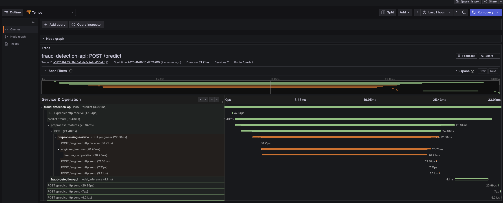

### 1. Distributed Tracing (OpenTelemetry + Tempo)

**Components:**
- Grafana Tempo container (ports 3200, 4317, 4318)
- OpenTelemetry instrumentation in both services
- Automatic span creation for all HTTP requests
- Context propagation between API and Preprocessing services
- Custom span attributes (transaction amount, fraud probability, risk level, etc.)
- Grafana Tempo datasource with traces-to-logs and traces-to-metrics correlation

**What You Get:**
- Complete request journey visualization (API to Preprocessing to Model)
- Timing breakdown for each operation
- Error tracking with full context
- Service dependency graph
- Automatic correlation with logs and metrics

### 2. Error Monitoring (Sentry)

**Components:**
- Sentry SDK integrated in API service
- Sentry SDK integrated in Preprocessing service
- Sentry SDK in Airflow training pipeline
- Sentry SDK in Airflow preprocessing pipeline
- Error tracking with stack traces
- Performance monitoring (APM)
- Release tracking with version tagging

**What You Get:**
- Real-time error notifications
- Email and Slack alerts for critical issues
- Error frequency and trend analysis
- Full stack traces with context
- User impact analysis
- Performance bottleneck identification

### 3. Enhanced Logging

**Updates:**
- Trace ID correlation in all logs
- Request and response logs include trace_id for correlation
- Automatic linking between logs and traces in Grafana

**Example Log:**
```
2025-11-09 03:22:54 - fraud_detection_api - INFO - log_requests:94 - Request: GET /metrics from 172.19.0.2 [trace_id=26d7f6f0903cecbd9f008563bf45dac3]
2025-11-09 03:22:54 - fraud_detection_api - INFO - log_requests:101 - Response: GET /metrics - Status: 200 - Duration: 0.007s [trace_id=26d7f6f0903cecbd9f008563bf45dac3]
```

### 4. Grafana Dashboards

**New Dashboard:**
- Fraud Detection Distributed Tracing dashboard
  - Total Request Rate (stat)
  - P95 Prediction Latency (stat)
  - P95 Feature Engineering Latency (stat)
  - Error Rate (stat)
  - Recent Traces - API Service (trace list)
  - Recent Traces - Preprocessing Service (trace list)
  - Error Traces (filtered view)
  - Slow Traces over 500ms (filtered view)

**Existing Dashboards Enhanced:**
- Metrics dashboard now links to traces
- Logs dashboard now links to traces
- Traces dashboard links to logs

### 5. Documentation

**Covers:**
- Architecture diagrams
- Setup instructions
- TraceQL query examples
- Sentry configuration
- Troubleshooting guide
- Performance impact analysis

## Files Modified

### Configuration Files
```
docker-compose.monitoring.yaml          # Added Tempo container
docker-compose.api.yaml                 # Added OTEL & Sentry env vars
docker-compose.preprocessing.yaml       # Added OTEL & Sentry env vars
```

### New Configuration Files
```
monitoring/tempo/tempo-config.yaml                          # Tempo configuration
monitoring/grafana/provisioning/datasources/tempo.yml       # Tempo datasource
monitoring/grafana/provisioning/dashboards/fraud_detection_traces.json
```

### Python Files - API Service
```
api/requirements.txt           # Added opentelemetry-*, sentry-sdk
api/tracing_config.py          # OpenTelemetry setup
api/sentry_config.py           # Sentry configuration
api/main.py                    # Updated with tracing & error monitoring
```

### Python Files - Preprocessing Service
```
preprocessing_service/requirements.txt    # Added opentelemetry-*, sentry-sdk
preprocessing_service/tracing_config.py   # OpenTelemetry setup
preprocessing_service/sentry_config.py    # Sentry configuration
preprocessing_service/main.py             # Updated with tracing & error monitoring
```

### Airflow DAGs
```
dags/training.py                          # Sentry integration
dags/preprocessing_pipeline.py            # Sentry integration
```

### Documentation
```
TRACING.md                              
```

## Deployment Instructions

The script will:
1. Rebuild services with new dependencies
2. Start monitoring stack (Prometheus, Grafana, Loki, Tempo)
3. Restart application services
4. Generate test traces
5. Verify everything is working

```bash

# Step 1: Rebuild services
docker compose -f docker-compose.preprocessing.yaml build
docker compose -f docker-compose.api.yaml build

# Step 2: Start monitoring stack
docker compose -f docker-compose.monitoring.yaml down
docker compose -f docker-compose.monitoring.yaml up -d

# Step 3: Restart services
docker compose -f docker-compose.preprocessing.yaml restart
docker compose -f docker-compose.api.yaml restart

# Step 4: Wait for services to be ready
sleep 15

# Step 5: Generate test trace
curl -X POST http://localhost:8000/predict \
  -H "Content-Type: application/json" \
  -d '{"TransactionAmt": 150.0, "card1": 13926}'
```

### Sentry Setup (Optional)

1. **Create account**: https://sentry.io/signup/
2. **Create project**: Python → FastAPI
3. **Get DSN**: Copy from project settings
4. **Update files**:
   ```yaml
   # In docker-compose.api.yaml and docker-compose.preprocessing.yaml
   environment:
     SENTRY_DSN: "https://your-key@o123456.ingest.sentry.io/123456"
   ```
5. **Rebuild**: `docker compose -f docker-compose.api.yaml build`

## Verification Checklist

### Tempo Running
```bash
curl http://localhost:3200/ready
# Expected: {"ready":"true"}
```

### Services Configured
```bash
docker logs fraud-detection-api | grep "OpenTelemetry"
# Expected: OpenTelemetry tracing configured with Tempo backend

docker logs preprocessing-service | grep "OpenTelemetry"
# Expected: OpenTelemetry tracing configured with Tempo backend
```

### Traces Visible in Grafana
1. Open http://localhost:3000 (admin/admin123)
2. Go to Dashboards then Fraud Detection Distributed Tracing
3. Should see traces in Recent Traces panels

### Trace-Log Correlation
1. In Grafana, go to Explore then Tempo
2. Find any trace
3. Click on a span then Logs for this span
4. Should see correlated logs with matching trace_id

### Sentry Working (if configured)
1. Open https://sentry.io
2. Go to your project
3. Trigger an error: `curl -X POST http://localhost:8000/predict -d '{}'`
4. Should see error in Sentry Issues

## Access Points

| Service | URL | Credentials |
|---------|-----|-------------|
| Grafana | http://localhost:3000 | admin / admin123 |
| Prometheus | http://localhost:9090 | - |
| Tempo | http://localhost:3200 | - |
| Loki | http://localhost:3100 | - |
| API Service | http://localhost:8000 | - |
| Preprocessing | http://localhost:8031 | - |
| Sentry | https://sentry.io | Your account |

## Key Features

### 1. Automatic Request Tracing

Every HTTP request automatically creates a trace:

```
▼ POST /predict [500ms]
  ├── predict_fraud [450ms]
  │   ├── preprocess_features [50ms]
  │   │   └── HTTP POST /engineer [45ms]
  │   │       └── engineer_features [40ms]
  │   │           └── feature_computation [35ms]
  │   └── model_inference [380ms]
  └── Response [5ms]
```

### 2. TraceQL Queries

Find specific traces using TraceQL:

```traceql
# Slow predictions
{service.name="fraud-detection-api" && duration>500ms}

# High-value transactions
{span.transaction.amount>1000}

# Fraud detections
{span.prediction.is_fraud=true}

# Errors
{status=error}
```

### 3. Service Map

Visualize service dependencies:
- Grafana → Explore → Tempo → Service Graph tab

### 4. Logs ↔ Traces Correlation

Click any:
- **Trace span** → See related logs
- **Log entry** → See full trace

### 5. Metrics ↔ Traces Correlation

Click any:
- **Prometheus metric spike** → See example traces
- **Trace** → See related metrics

### 6. Custom Span Attributes

Every trace includes:
- `transaction.amount` - Transaction value
- `prediction.is_fraud` - Fraud detection result
- `prediction.risk_level` - Risk classification
- `prediction.probability` - Fraud probability
- `features.count` - Number of features generated
- `processing.duration_ms` - Operation timing

## Example Workflows

### Debugging Slow Requests

1. **Notice latency spike** in Prometheus/Grafana
2. **Search Tempo**: `{duration>500ms}`
3. **Click trace** to see timing breakdown
4. **Identify bottleneck**: e.g., "model_inference took 380ms"
5. **View logs**: Click span → "Logs for this span"
6. **Fix issue** and verify with new traces

### Investigating Errors

1. **Get alert** from Sentry: "ValueError in predict_fraud"
2. **Open Sentry** → See full stack trace
3. **Copy trace ID** from Sentry breadcrumbs
4. **Open Grafana** → Explore → Tempo
5. **Search**: Paste trace ID
6. **View trace** to see what happened before error
7. **Check logs** for additional context

### Performance Optimization

1. **Open traces dashboard**
2. **Sort by duration** (longest first)
3. **Analyze slow traces**:
   - Which operations are slow?
   - Are there unnecessary calls?
   - Database queries taking too long?
4. **Optimize code**
5. **Compare new traces** to verify improvement

## Architecture Summary

```
┌─────────────────────────────────────────────────────────┐
│                     Grafana (3000)                      │
│  ┌───────────────┬───────────────┬───────────────┐     │
│  │   Metrics     │     Logs      │    Traces     │     │
│  │ (Prometheus)  │    (Loki)     │    (Tempo)    │     │
│  └───────────────┴───────────────┴───────────────┘     │
└─────────────────────────────────────────────────────────┘
           ▲                ▲                ▲
           │                │                │
    ┌──────┴────────┬───────┴─────────┬─────┴──────┐
    │               │                 │            │
┌───▼────┐   ┌──────▼──────┐   ┌─────▼─────┐  ┌──▼────┐
│Prometheus│  │   Loki     │   │   Tempo   │  │Sentry│
│  :9090  │   │   :3100    │   │   :3200   │  │ Cloud │
└────▲────┘   └──────▲──────┘   └─────▲─────┘  └───▲───┘
     │               │                │            │
     │               │                │            │
┌────┴───────────────┴────────────────┴────────────┴────┐
│            Application Services                        │
│  ┌──────────────────┐      ┌──────────────────┐      │
│  │  API Service     │─────▶│  Preprocessing   │      │
│  │  (FastAPI)       │      │    Service       │      │
│  │  + OpenTelemetry │      │  + OpenTelemetry │      │
│  │  + Sentry SDK    │      │  + Sentry SDK    │      │
│  └──────────────────┘      └──────────────────┘      │
└───────────────────────────────────────────────────────┘
```
